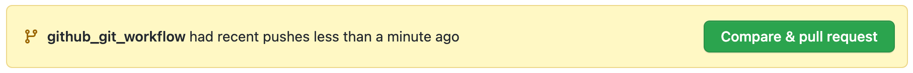
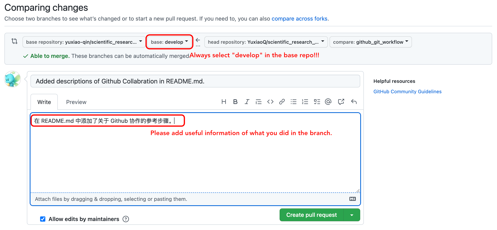

# Scientific Research with Python Playground

This is a demo repository for doing scientific research with python. In this repo, you can:

- See instructions on how to do scientific research with python;
- Play around with the repo, and learn how to do python;
- Understand how to collaborate with others on a project.

This repo belongs to APRILab.

## Where to start?

For APRILab members, please go through the corresponding seminar lectures to learn how to use this repo. A list of seminars can be found in our [wiki](https://insarlab.atlassian.net/wiki/spaces/~854136102/pages/263782626/Seminar+List).

## Github Collaboration Workflow

**PLEASE FOLLOW THESE STEPS WHEN COLLABORATING ON GITHUB REPOS.**

### 1. Creating a Fork

Go to the GitHub repo you want to collaborate on, and click the "Fork" button.

```shell
# Clone your fork to your local machine / server
git clone git@github.com:yuxiao-qin/scientific_research_with_python_demo.git
```

### 2. Link your forked repo to the upstream

To make sure your fork is up to date with the original "upstream" repo that you forked, do:

```shell
# Add 'upstream' repo to list of remotes
git remote add upstream https://github.com/UPSTREAM-USER/ORIGINAL-PROJECT.git
```

Update your branch to sync with the upstream:

```shell
# Fetch from upstream remote
git fetch upstream
```

Now, checkout your own branch and merge the upstream repo's branch. **Always checkout from the develop branch, merge to develop branch and submit a pull request to the upsteam develop branch.**

```shell
# Checkout your develop branch and merge upstream
git checkout develop
git merge upstream/develop
```

If there are no unique commits on the local master branch, git will simply perform a fast-forward. *However*, if you have been making changes on develop (in the vast majority of cases you **shouldn't** be - [see the next section](#doing-your-work), you may have to deal with conflicts. When doing so, be careful to respect the changes made upstream.

Now, your local develop branch is up-to-date with everything modified upstream.

### Doing Your Dev Work

#### Create Your Own Dev Branch

Whenever you begin work on a new feature or bugfix, it's important that you create a new branch. Not only is it proper git workflow, but it also keeps your changes organized and separated from the develop branch so that you can easily submit and manage multiple pull requests for every task you complete.

To create a new branch and start working on it:

```shell
# Checkout the develop branch - you want your new branch to come from the latest develop branch
git checkout develop

# Create a new branch named newfeature (give your branch its own simple informative name)
git branch -b newfeature
```

Now, go to do your hacking work! Remember to commit often!

```shell
# commit your changes in git
git commit -a -m "Added a new feature that does X"

# push your commits to your fork repo
git push origin newfeature
```

### Submitting a Pull Request

When you feel that your work is ready to be reviewed and merged into the upstream repo, you should submit a pull request. This should be done in the Github Web UI:



Submit a pull request to the upstream repo's `develop` branch:


After this, tell the upstream repo's maintainers that you have submitted a pull request and that they should review it. You can do this by leaving a comment on the issue you are working on, or by sending them a message.

### When Your Pull Request is Merged, or When You Start to Work in the Morning

Since the upstream could evolve everyday, you should always keep your fork up to date with the upstream. To do so, you should follow the steps below:

```shell
# Fetch upstream develop and merge with your repo's develop branch
git fetch upstream
git checkout develop
git merge upstream/develop

# Go the the branch you're currently working on, and update it with the upsteam's develop branch:
git checkout newfeature
git rebase develop

# push to your forked repo after the update:
git push origin newfeature
```

**Main Reference**
* [GitHub Standard Fork & Pull Request Workflow](https://gist.github.com/Chaser324/ce0505fbed06b947d962)

**Additional Reading**
* [Atlassian - Merging vs. Rebasing](https://www.atlassian.com/git/tutorials/merging-vs-rebasing)

**Sources**
* [GitHub - Fork a Repo](https://help.github.com/articles/fork-a-repo)
* [GitHub - Syncing a Fork](https://help.github.com/articles/syncing-a-fork)
* [GitHub - Checking Out a Pull Request](https://help.github.com/articles/checking-out-pull-requests-locally)